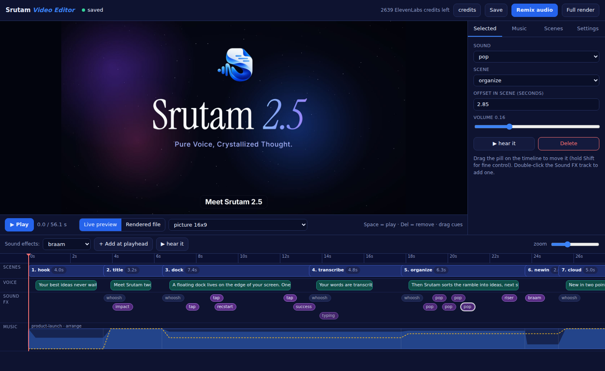

# Srutam launch video

The Srutam 2.5 launch film (16:9 and 9:16), built with [Remotion](https://remotion.dev) plus ElevenLabs narration, sound effects and music loops. Everything is reproducible from this folder, and one script drives the whole pipeline.

## Setup (once per machine or session)

```bash
cd launch/video
npm ci                                   # Remotion + deps (needs registry.npmjs.org)
echo "ELEVENLABS_API_KEY=sk_..." > .env  # or export ELEVENLABS_API_KEY; .env is gitignored
```

Requirements:
- Node 22+, ffmpeg/ffprobe, Python 3.10+ (standard library only).
- A Chromium headless shell. The path is set in `video.config.json` → `render.browser` and in `remotion.config.ts`.
- Network access to `api.elevenlabs.io` for any generation step.

## Edit it yourself (no AI needed)

```bash
python3 srutam_video.py editor        # then open http://127.0.0.1:8765
```



The editor runs only on your machine; your ElevenLabs key stays on the server and never reaches the browser.

- **Timeline** (bottom): scenes, narration, sound-effect cues and the music curve.
  - Drag a sound pill to retime it; press `Del` to remove it; double-click the Sound FX row to add one.
  - Click a scene or a music section to edit it in the panel on the right.
- **Live preview** (`Space`): plays the picture together with your narration, sound effects and music straight away, with no render. It is an approximation; **Remix audio** builds the exact result.
- **Remix audio** (~1 min) rebuilds the music and re-mixes the audio onto the existing picture. **Full render** (~10 min) is only needed after changing scenes, narration length or captions.
- **Music tab:** pick a track, choose a steady loop or one scored to the edit, set levels (louder when no one speaks, quieter under the narrator), or generate a new loop (costs credits).
- **Scenes tab / panel:** reorder, remove and re-add scenes, change their length, edit and regenerate the narration (costs credits).
- **Settings tab:** captions on/off, and the whoosh on every scene change.

Everything you change is saved to **`plan.json`**, the single source of truth. You can also edit that file by hand. A copy of the previous version is kept in `plan.backup.json`.

For visual changes (layout, copy inside scenes), use Remotion Studio: `npx remotion studio`.

## The script

`python3 srutam_video.py <command>`:

| Command | What it does | Time | ElevenLabs cost |
|---|---|---|---|
| `credits` | Shows the credits left. | 1s | 0 |
| `timeline` | Prints scene start times and lengths. | 1s | 0 |
| `voice --audition` | Reads line 1 in each audition voice. | 10s | ~150 |
| `voice [--only id ...]` | Narration plus word timings for every scene (or only the named scenes). | 30s | ~1 per character (~650 in total) |
| `sfx [name ...]` | Sound effects defined in `video.config.json`. | 30s | 40/second (~450 for all) |
| `music gen <preset> [--seconds 20]` | A new seamless music loop. | 20s | 40/second (800 for 20s) |
| `music use <preset>` | Loops a sample to the video length with fades. | 2s | 0 |
| `music build` | Rebuilds `public/music.wav` from `plan.json` (the editor does this on Remix). | 5s | 0 |
| `editor [--port]` | Opens the visual editor. | instant | 0 |
| `music arrange <preset>` | Scores a loop to the edit, following `ARRANGEMENT` in `srutam_video.py`: muffled intro, open on the title, a drop at "New in 2.5", a breakdown at Trust, a full ending. | 5s | 0 |
| `music previews` | 32-second previews of every sample, written to `launch/music/`. | 5s | 0 |
| `stills [--fmt 9x16] [--at 10,20]` | Contact sheet for review; by default one frame per scene. | ~1 min | 0 |
| `render --audio-only [--suffix=-funk]` | Remixes the audio onto the last picture render. `--suffix` names a variation so it doesn't overwrite the main files. | ~1 min | 0 |
| `render [--fmt 16x9]` | Full render: picture, audio mix, -14 LUFS, mux. | ~5 min per format | 0 |
| `check` | Duration, loudness and size of the final files. | 5s | 0 |

The outputs are `launch/srutam-2.5-launch-16x9.mp4` and `launch/srutam-2.5-launch-9x16.mp4`.

### Common recipes

- **Try a new song:**
  1. Add a prompt under `music.presets` in `video.config.json`.
  2. `music gen my-song`
  3. `music use my-song`
  4. `render --audio-only`
- **Change a narration line:**
  1. Edit `vo:` in `src/timeline.ts`.
  2. `voice --only <scene>`
  3. `music use <current>`, because the video length may have changed.
  4. `render`
- **Change visuals:**
  1. Edit `src/scenes/*.tsx`.
  2. `stills --at <secs>` to check the frames.
  3. `render`
- **Live preview:** `npx remotion studio`.

## Notes

- ElevenLabs' **Music API needs a paid plan**. On the free tier, music comes from the Sound Effects model with `loop: true`, at most 30 seconds, and is looped to length.
- `gen/music.py` is a free synthesized fallback bed: `python3 gen/music.py <seconds> '<scene-starts json>'`.
- Generated audio is committed (`public/vo`, `public/sfx`, `public/music-samples`), so nobody pays for it twice. `public/music.wav`, `out/` and the `.mp4` files are regenerated.
