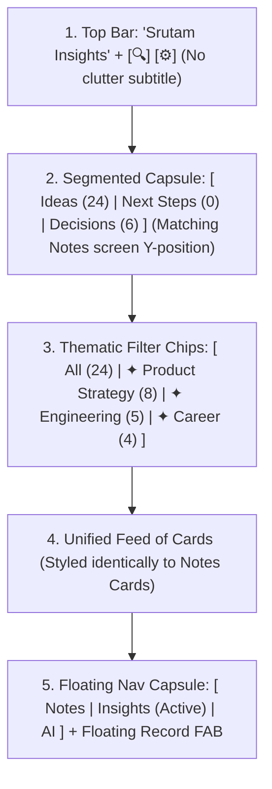

# Srutam Unified Insights Screen: Architecture & Implementation Plan

> **Status:** Refined & Unified Design Proposal  
> **Current Branch:** `feature/action-item-lifecycle`  
> **Design References:** `screen_notes_live.png` (Notes reference) & `unified_insights_screen_1790504247899.jpg` (Proposed View)  

---

## 1. Branch Progress Audit (`feature/action-item-lifecycle` vs `plan.md`)

| Phase / Feature | Status | What's Implemented | What's Pending |
| :--- | :---: | :--- | :--- |
| **Lifecycle Infrastructure (Auto-archive & Purge)** | ✅ **100%** | `InsightLifecycleManager.kt` auto-archives completed tasks older than 3 days; purges 30-day archived items and 60-day reminders on app start. | Completed. |
| **Reboot Alarm Resilience** | ✅ **100%** | `BootRescheduleReceiver.kt` listens to `BOOT_COMPLETED` and reschedules all active alarms via `ReminderScheduler`. | Completed. |
| **Overdue Auto-Dismissal** | ✅ **100%** | `ReminderDao.autoDismissOverdue()` runs on startup with a 1-hour grace window. | Completed. |
| **Alarm Cancellation on Action** | ✅ **100%** | `AudioFilesViewModel.updateReminderStatus()` cancels scheduled `AlarmManager` intents when marked `COMPLETED` or `DISMISSED`. | Completed. |
| **Past Reminders History** | 🟡 **80%** | DAO query + collapsible section added in `ActionItemsScreen.kt`. | Needs visual alignment with new unified card styling. |
| **Event vs Milestone Classification** | 🔴 **0%** | Not started. All items with dates are still treated as alarming `REMINDER`s. | Model distinction: `MEETING` (alarm) vs `TARGET_DATE` (passive badge). |
| **UI Unity with Notes Screen** | 🔴 **0%** | Not started. Insights screen currently has mismatched cards, awkward subtitle, and buried ideas. | Re-align layout, top bar, segmented capsule, and card anatomy with `FeedScreen.kt`. |
| **Theme Resolution (Human Titles)** | 🔴 **0%** | Not started. Raw file IDs (`recording_...`) and `"Not related"` button are still shown. | Map recording IDs to titles; convert themes into horizontal filter chips. |
| **Ideas Organization & Filtering** | 🔴 **0%** | Not started. 24 ideas are buried under an empty Next Steps tab. | Smart default tab to `IDEAS` when Next Steps = 0; horizontal thematic filter chips. |

---

## 2. Visual Architecture & Design System Alignment

### The Root Problem: Screen Disconnection
Comparing `screen_notes_live.png` (Notes) and `current_screen.png` (Insights):
1. **Top Bar Rhythm Broken:** Notes has a clean `Srutam` with `[🔍] [⚙️]`. Insights has an awkward `🔒 Transcribed on this device` teal subtitle that breaks Y-alignment.
2. **Segmented Capsule Displaced:** On Notes, the filter capsule (`All Notes | Pending AI`) sits immediately below the top bar. On Insights, the capsule is pushed halfway down the screen by huge reminder banners.
3. **Card Inconsistency:** Notes cards have standard `20dp` squircle corners, soft pill badges (`✦ Summarized`), timestamp subtitles, and bottom action rows. Insights cards have loud amber borders, confusing buttons like `"Not related"`, and raw DB keys (`recording_1789041047256`).
4. **Stacked Clutter:** Insights tries to stack 5 different concepts vertically: Reminders $\rightarrow$ Past Reminders $\rightarrow$ Capsule $\rightarrow$ Progress Bar $\rightarrow$ Themes $\rightarrow$ Items.

---

### The Unified Layout Hierarchy

---

## 3. Concrete Specifications for the New View

### A. Top Bar & Segmented Capsule
* Remove the teal `🔒 Transcribed on this device` subtitle from `ActionItemsScreen.kt`.
* Place `SingleRowInsightsCapsule` directly at the top with identical margins (`horizontal = 16.dp, vertical = 8.dp`), matching the Notes screen's `All Notes | Pending AI` capsule.
* **Smart Default Tab:** If `activeActions.isEmpty()` and `allIdeas.isNotEmpty()`, default to `InsightsTab.IDEAS` so the user is immediately greeted with their 24 rich ideas.

### B. Horizontal Theme Filter Chips (Replacing the Clunky Theme Card)
* Instead of a giant disruptive card with `"Not related"`, place a horizontal scrollable row of sleek pill chips directly below the capsule:
  - `All (24)` (active pill)
  - `✦ Product Strategy (8)`
  - `✦ Engineering (5)`
  - `✦ Career (4)`
* Clicking a theme chip filters the feed instantly.
* Long-pressing or swiping a chip gives options to *Dismiss* or *Rename* the theme.

### C. Unified Card Anatomy (Matching Notes Screen Exactly)
Every insight card (Idea, Decision, or Milestone) shares the exact visual skeleton of `AudioFileItem` in `FeedScreen.kt`:
* **Container:** `shape = RoundedCornerShape(20.dp)`, `color = CeramicWhite` (or `CosmicVoidCard` in dark mode), subtle `1.dp` border.
* **Header Row:**
  - Bold Title on left (16sp, FontWeight.SemiBold).
  - Soft pill badge on right:
    - Idea: `💡 Product` (soft purple / amber pill)
    - Target Date / Milestone: `🎯 Target · May 20` (soft amber / teal pill)
    - Decision: `⚖️ Decision` (soft slate pill)
* **Subtitle:** Relative timestamp (e.g. `Today, 9:28 am` or `Yesterday, 10:26 pm`).
* **Content:** 2-line preview or rationale.
* **Bottom Row:**
  - Origin Note Pill (e.g. `Product Roadmap Call`, resolved from recording name or formatted human date) with note icon.
  - 3-dot overflow menu (`⋮`) with quick actions:
    - *Convert to Next Step*
    - *Share / Copy*
    - *Dismiss / Archive*

### D. Next Steps & Action Progress (When Next Steps Tab is Selected)
* If `pendingActions.isEmpty()` and `completedActions.isNotEmpty()`:
  - Display a sleek single-row card: `[ ✓ All caught up · 1 task completed | Archive ]`.
* If `pendingActions.isNotEmpty()`:
  - Clean interactive checklist cards matching the `20dp` squircle silhouette, with check circles on the left.

---

## 4. Phased Implementation Roadmap

1. **Step 1: UI Alignment & Top Rhythm (`ActionItemsScreen.kt`)**
   - Align TopAppBar with Notes screen (remove subtitle, standardize paddings and squircle action buttons).
   - Move Segmented Capsule to the top directly below the header.
   - Implement smart tab selection defaulting to `IDEAS` when Next Steps = 0.

2. **Step 2: Thematic Filter Chips Bar**
   - Transform `ThemeCluster` list from vertical card blocks into a horizontal filter chips row.
   - Filter `allIdeas` based on the selected theme chip.

3. **Step 3: Unified Card Component (`InsightCard.kt`)**
   - Standardize `IdeaCard`, `DecisionCard`, and `ReminderCard` onto a single cohesive layout pattern matching `FeedScreen.kt`'s `AudioFileItem`.
   - Resolve recording IDs to readable note titles via `repository.allRecordings`.

4. **Step 4: Milestone vs Meeting Separation**
   - Integrate target dates (like *"Tennox Profit Projection Target"*) as milestone cards in the unified feed with `🎯 Target · May 20` badges rather than loud, disruptive alarm popups.

5. **Step 5: Roborazzi Snapshot & Live Device Verification**
   - Re-run Roborazzi screenshot matrix tests across phone, foldable, and tablet form factors.
   - Verify visually against the Notes screen on connected physical device.
